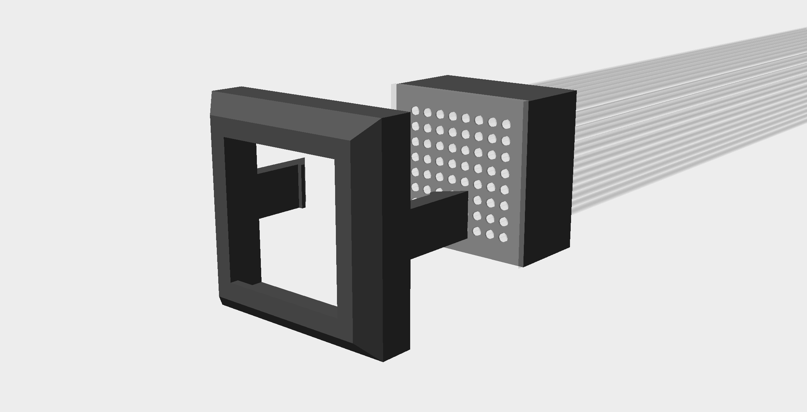
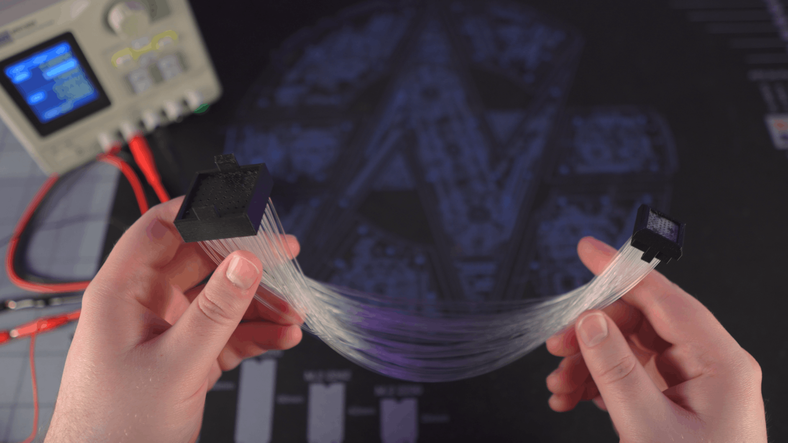

# Fiberoptic Dot Matrix Display

Converts a standard 8x8 LED matrix into a smaller dot-matrix-display (DMD) using fiberoptics. Using the [Customization](#customization) section, you can also combine multiple 8x8 LED matrices into a single DMD panel.

## Download

Want to use the default models? [Get them at Printables!](https://www.printables.com/model/375859-fiberoptic-dot-matrix-display)

## Required Parts and Tools

* FDM or SLA 3D printer
* 8x8 LED matrix
* 1mm (0.04") fiberoptic filament
* 1mm (0.04") thick clear plastic sheet
* Superglue
* Pin vise drill with 1mm-1.5mm bit

## Assembly

1. Print the bezel, frame, and LED matrix mount.
   * :memo: Check out the [Customization](#customization) section if you want to change the size of the display.
1. Ensure your filament will fit snuggly in each hole of the frame and LED matrix mount.
   * The LED matrix mount is designed to not allow fibers to touch the LED panel but the fibers should insert most of the way.
   * Drill out any undersized holes.
1. Cut the clear plastic sheet to fit within the bezel.
1. Insert the clear plastic sheet into the bezel and snap the frame in behind it.
1. Cut a section of fiberoptic filament for each hole in the frame.
   * :memo: You may find it difficult to assembly later if the lengths of fiber are less than 300mm (~1ft) long.
1. For each fiber, glue one end into the frame and the other end into the corresponding hole on the LED matrix mount.
   * Ensure each fiber is pressed all the way into the frame and LED matrix mount. Recessed fibers will create darker dots in the final display.
   * You may find it easier to glue one row of fibers at a time.
1. Install the LED matrix into the LED matrix mount.

## Customization

Want to make a larger display or use different filament diameters? Try customizing these models in OpenSCAD:

1. First, download [OpenSCAD](https://openscad.org/downloads.html) 2021.01 or newer. This is the 3D design software used to create these models.
1. Next, you'll need to download a copy of this project. If you aren't familiar with git/GitHub, I recommend downloading the project as a zip:
   1. Click the green **Code** button on the main page of this repository.
   1. Select **Download ZIP**.
   1. Unzip the contents somewhere on your computer.
1. Launch OpenSCAD and open the included **fiberoptic_dmd.scad** file.
1. Once open, select **Window** from the menu bar and choose **Customizer**. You should see several configuration options appear on the right side.
1. In the customizer panel, expand the **Preview Options** section, locate the **part** drop-down, and choose the part you wish to customize.
1. In the customizer panel, expand the **Model Options** section and customize the model's settings as you see fit.
   * The rendered model may not reflect the changes until you press enter (even if you used the up-down arrows).
1. When you're ready to print your model, first locate the **quality** drop-down in the **Preview Options** section and change it to **Medium** or **High**.
   * Depending on your computer's specs, OpenSCAD may freeze for several seconds while it processes the changes.
1. Once OpenSCAD is responsive again, you'll need to render the model by pressing **F6** or by selecting Design from the main menu and choosing **Render**. Depending on your computer's specs, OpenSCAD may freeze for several minutes while it processes the changes.
1. Once the render is complete, you can directly export an STL of the part by either pressing **F7** or selecting **File**, hovering over **Export**, and choosing **Export as STL...**.

:exclamation: While you can make a 16x8 or larger display from multiple 8x8 matrices, I recommend against it. The display becomes exponentially harder to assemble with each additional row/column. Additional fibers also make the connection between the mount and display far less flexible.
